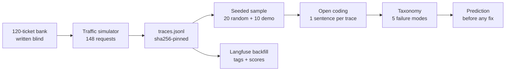
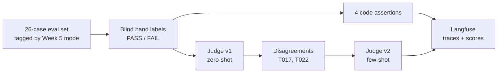

# Weeks 5 & 6: Error Analysis and Judge Validation

As of 2026-09-21

## Summary

Week 5 found out how the support RAG app fails by reading real traces. Week 6 checked whether an LLM judge can spot those failures as well as a person can.

| | Week 5: error analysis | Week 6: judge validation |
| --- | --- | --- |
| Question | How does the app fail on real support traffic? | Can we trust an LLM score of reply quality? |
| Input | 148 traced support requests; 20 read by hand | 26 ticket replies, each tagged with a Week 5 mode |
| Headline | 9 of 20 traces had a defect (45%), across 5 failure modes | Judge agrees with blind human labels 92–96% of the time |
| Surprise | 11 of 20 were clean, including 6 refusals that were correct | The v1 → v2 prompt change added 0 points when both were measured the same way |
| Where the evidence lives | [docs/week5/](week5/) | [docs/week6/README.md](week6/README.md), [backend/eval/week6/](../backend/eval/week6/) |

---

## Week 5: what was implemented

Week 5 added per-request tracing, ran 148 real requests through the app, and read a random 20 of them by hand. Each step landed in its own commit, in order, so the history shows no fix was made before the analysis.

Every downstream file is derived from the single pinned trace file.

| Piece | What it does | Where |
| --- | --- | --- |
| Ticket bank | 120 support questions written from article headings only, committed before any tracing code existed | `backend/eval/week5/ticket_bank.jsonl` |
| Trace log | One JSON record per chat request: query, filters, ranked chunks with scores, gate decision, full prompt, raw model output, latency. Off by default | `backend/app/services/tracing.py` |
| Traffic simulator | Sends the bank plus 14 demo questions and 14 controls through the real pipeline with a seeded mix of retriever, top_k and filters | `backend/scripts/simulate_support_traffic.py` |
| Seeded sampler | Draws 20 random and 10 demo traces with seed 20260907, so the sample can be re-drawn exactly | `backend/scripts/sample_traces.py` |
| Replay | Rebuilds one trace (TR-0023) from its record and re-runs retrieval and generation; retrieval matched rank for rank | `backend/scripts/replay_trace.py`, `docs/week5/replay.md` |
| Open coding and taxonomy | One plain sentence per sampled trace, then clustered into 5 modes, one mode per trace | `docs/week5/notes.md`, `docs/week5/taxonomy.md` |
| Langfuse sink | Sends the same trace record to Langfuse as a trace with retrieval and generation observations | `backend/app/services/langfuse_sink.py` |
| Langfuse backfill | Pushes the 148 analysed traces with tags `week5`, `sampled-random`, `mode:1`…`mode:5`, `no-defect-seen` and a `week5_has_defect` score | `backend/scripts/push_traces_to_langfuse.py` |
| Error-analysis UI | Trace list, filters, taxonomy table and trace detail panel in the frontend | `frontend/src/components/pages/ErrorAnalysisPage.tsx` |

The run itself used `openai/gpt-oss-120b` on Groq at temperature 0, a 7-article corpus split into 30 chunks, and a score gate of 0.15. None of the 148 requests errored, and median latency was 6.5 s.

---

## Week 5: what was learned

The most common failure was a refusal the app didn't need to make. The retriever found the answer, and then a fixed score threshold discarded it before the model saw it.

| # | Failure mode | Count of 20 | Severity | Example |
| --- | --- | ---: | --- | --- |
| 1 | Refuses while the chunk that answers it is ranked first | 3 (15%) | annoys the user | TR-0055 |
| 2 | Says it does not know and still names a source file | 2 (10%) | embarrasses the client | TR-0012 |
| 3 | Prints the citation in a bracket style no other answer uses | 2 (10%) | annoys the user | TR-0045 |
| 4 | Tells a paying legacy subscriber it cannot say whether their plan is valid | 1 (5%) | embarrasses the client | TR-0112 |
| 5 | Stops mid-word at the length cap | 1 (5%) | annoys the user | TR-0035 |
| — | No defect seen | 11 (55%) | — | TR-0098 |

**Lessons**

- **Short queries break a cosine gate.** "how much is that?" scored 0.1414 and "500" scored 0.1289, just under the 0.15 threshold. In both cases the answering chunk was ranked first. A one-word query embeds poorly against a 700-character chunk, so a low score doesn't mean the answer is missing.
- **The demo set hides the real failure rate.** On the 10 curated demo questions, mode 1 appeared 0 times and any defect appeared 3 times (30%). On the random 20 the figures were 15% and 45%. Demo questions are paraphrases of sentences in the articles, so they can never produce a mode 1 refusal.
- **The control ruled out the easy explanation.** Running the demo questions without document scoping changed nothing: all 10 were still correct. The demo is clean because of how its questions were written, not because the UI narrows the search.
- **A clean residual is a real result.** 11 of 20 traces had no defect, and 6 of those were correct refusals. With 20 traces, one trace is 5 points, so modes 3, 4 and 5 can't be ranked against each other reliably.
- **Public benchmarks would not find these.** Every mode depends on this corpus: the ₹500 charge that means two different things, and the legacy plan packs that shadow the retail ones. A benchmark that scores only the final answer can't tell a gate refusal from a truly unanswerable question.
- **Commit the prediction before the fix.** The prediction (commit `4f78158`) targets mode 1. It proposes skipping the gate for queries under 4 tokens, and expects mode 1 to fall from 3/20 to 1/20 or fewer. Three guardrails must not move: no new invented answers, at least 10/20 clean, and hit-rate@3 staying at 11/12.

---

## Week 6: what was implemented

Week 6 built a 26-case eval set, labelled it by hand before any judge ran, moved four checks into code, and measured an LLM judge against the hand labels. The commit order proves the labels came first: labels in `d5dacc3`, the v1 judge run in `13b7728`, v2 in `e9e53a2`.

The judge prompt only changed in response to its own disagreements with the labels.

| Piece | What it does | Where |
| --- | --- | --- |
| Eval set | 26 ticket replies covering all 5 Week 5 modes plus no-defect-seen. 3 are byte-identical replays of failed Week 5 traces (T012, T055, T112) | `backend/eval/week6/eval_set_25.jsonl` |
| Blind labels | A PASS/FAIL label and a reason for each case, committed before any judge output existed | `backend/eval/week6/labels_25.json` |
| 4 assertions | Plain code checks: ticket ID echoed, refund amount stated in ₹, Priority tier escalated, no full refund after 30 days | `backend/scripts/evaluate_week6.py` |
| Judge v1 | Zero-shot prompt that grades a single criterion: binary resolution quality | `backend/eval/week6/judge_v1.txt` |
| Judge v2 | v1 plus T017 and T022 as examples with the human label, plus one calibration sentence | `backend/eval/week6/judge_v2.txt` |
| Majority vote | Each judge runs 3 times and the majority verdict counts, because the judge is not deterministic at temperature 0 | `--repeats` flag |
| Saved runs | Every judge run written to disk with the prompt hash and the labels commit | `backend/eval/week6/runs/` |
| Langfuse logging | One trace per ticket per run. Judge calls are logged as generations, with 6 scores per trace and tags for mode, tier, regression and assertion-failed | `log_to_langfuse` in `evaluate_week6.py` |
| Replay to Langfuse | The `--replay` flag pushes the committed runs without calling the judge again | `evaluate_week6.py --replay` |
| Tests | Checks the case count, the mode tags, that regressions are verbatim, and the commit ordering | `backend/tests/test_week6_deliverables.py` |

---

## Week 6: what was learned

The judge was already good before any iteration, and the v2 prompt change didn't improve it. Once both versions were measured the same way, agreement stayed flat at 96.2%. On the 24 cases v2 hadn't seen as examples, agreement dropped from 24/24 to 23/24.

| Measurement | Judge v1 | Judge v2 |
| --- | --- | --- |
| Protocol number (v1 single run → v2 majority of 3) | 92.3% (24/26) | 96.2% (25/26) |
| Same method both sides (majority of 3) | 96.2% (25/26) | 96.2% (25/26) |
| Held-out 24 cases (excluding T017, T022) | 100% (24/24) | 95.8% (23/24) |
| Disagreements | T017 | T010 (3 of 3 runs), T119 (1 of 3) |

**Lessons**

- **Run the judge more than once.** At temperature 0 the judge still flips. On 26 cases, one flip moves agreement by 3.8 points. The 92.3% "before" figure was a single run in which T022 happened to flip.
- **Measure agreement on cases the judge hasn't seen.** v2's scores on T017 and T022 are partly leakage, because their labels are in its prompt. The held-out figure is the honest one, and it went down.
- **Higher agreement can mean a worse judge.** On T017 the judge was right and the human label was wrong: the reply promised 24 hours against a 5–7 business-day policy. v2 "fixed" T017 by learning to accept that invented timeline. The label was left unchanged on purpose.
- **One prompt sentence can pull two ways.** The calibration sentence was meant to make the judge relax about small wording drift. It also made the judge stricter about completeness, which broke T010 and T119. The committed prediction foresaw the first effect but not the second.
- **Put what code can check in code.** Four criteria became plain checks, leaving the judge a single criterion. One check has a false positive: T016 restates the refund conditions, and the rule fires on the words "eligible for" plus "refund".
- **Averages hide the defect modes.** Overall, 65% of replies pass. But modes 1, 2, 4 and 5 pass 0% of the time, and the 16 clean cases carry the average. The judge and the human agree completely on every defect mode. All the disagreement is on replies with no defect.
- **Order is evidence.** Blind labels mean nothing unless you can show they came first. The tests re-check the commit order from `git log`.

---

## How to see it in Langfuse

Failure types are assigned by hand, not detected automatically. Each trace carries them as tags, so a single tag filter finds the matching traces from both weeks. Traces are in the `development` environment, so set **Env → development** and widen the time range.

| To answer | Filter or look at | Covers |
| --- | --- | --- |
| Did the request crash? | Tag `status:error`, or level ERROR | Every trace, including live ones |
| Did it refuse? | Tag `refused`. A `refused-before-generation` WARNING event means the gate stopped the question and the model was never called | Every trace |
| Was the reply cut off or empty? | `finish_reason` on the generation. A WARNING level means the model returned empty content | Every trace |
| Which failure mode? | Tag `mode:1` … `mode:5`, or `no-defect-seen` | The 30 sampled Week 5 traces and the 26 Week 6 cases |
| Why that mode? | The `week5_has_defect` score (1 = defect); its comment is the hand-written observation | The 20 + 10 sampled Week 5 traces |
| Did a rule check fail? | Tag `assertion-failed`, or the `assertions_passed` score | Week 6 cases |
| Does the judge agree with the human? | The `judge_v2_score`, `human_ground_truth` and `judge_v2_agreement` scores, plus the `judge_v2` generation for its reasoning | Week 6 cases |

**Demo path (about 5 minutes)**

1. Filter tag `week5`, then `sampled-random`: the 20 traces read by hand.
2. Filter tag `mode:1` and open `TR-0055`. The answering chunk is rank 1 in the retrieval step, the gate score is below 0.15, and there's no generation step.
3. Contrast with `no-defect-seen` and open `TR-0098`, a clean trace scored 0.
4. Filter tag `mode:5` and open `TR-0035`: the generation shows `finish_reason: length`.
5. Filter tag `replay`, the committed Week 6 runs, and open T010. `judge_v2_agreement` is 0, and the `judge_v2` generation shows why.

---

## Open items

- [ ] Score the Week 5 prediction: apply the under-4-token gate change, re-run the 120-ticket bank with seed 20260907, and check mode 1 plus the three guardrails
- [ ] Judge v3: remove v2's calibration sentence and keep only the examples, to test which change broke T010
- [ ] Tighten the `refund_amount_numeric` rule so it fires only when a refund is being granted (fixes the T016 false positive)
- [ ] Classify live traffic automatically: run the assertions and the judge on new traces and write the results back as Langfuse scores
- [ ] Add a Langfuse model price for `openai/gpt-oss-120b` so judge cost shows up
- [ ] Delete the 2 stale test traces in session `week6-20260921T072507Z` that still carry the old `mode:no_defect_seen` tag
- [ ] RAGAS bonus: not attempted
